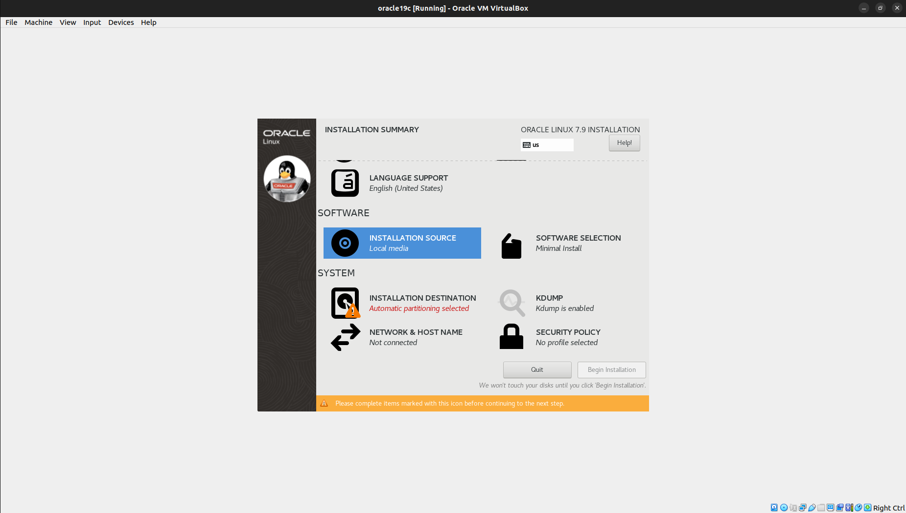
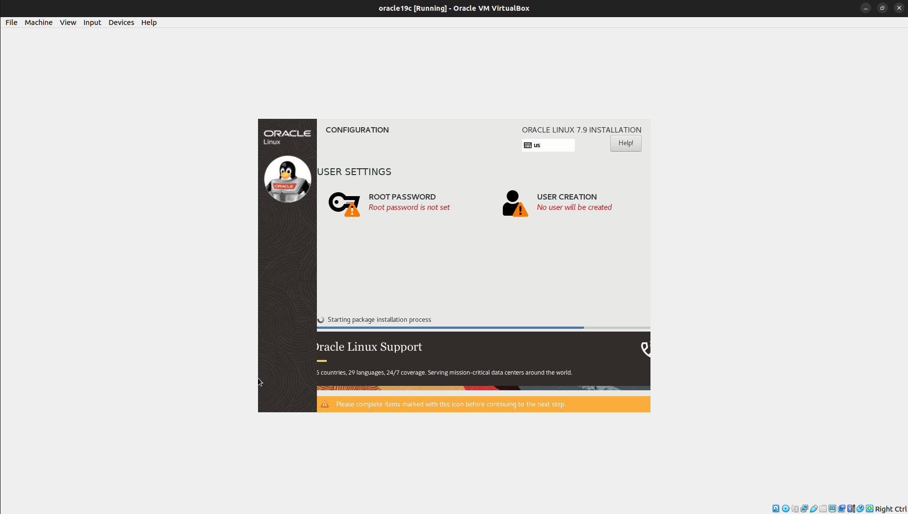

# Como criar um servidor de Banco de dados Oracle

### Será necessário instalar algumas coisas:

- [Oracle Linux 7.9](URL "https://edelivery.oracle.com/osdc/faces/SoftwareDelivery")
- [Oracle VirtualBox](URL "https://www.virtualbox.org/wiki/Downloads")
- [MobaXTerm (Caso eseteja utulizando Windows)](URL "https://mobaxterm.mobatek.net/download.html")
- [ZIP dos binários do Oracle Database](URL "https://www.oracle.com/br/database/technologies/oracle19c-linux-downloads.html")

# Futuramente adicionar prints dos sites aqui

### Após as instalações podemos abrir o **Virtual Box** e criar uma nova Máquina Virtual (VM) para instalarmos o **Oracle Linux**

Agora podemos decidir um nome para a nossa VM, eu vou utilizar o nome **oracle19c**,
tendo em vista que essa VM será responsavel por manter um servidor com o Oracle 19c instalado nela

Agora podemos apertar em próximo para seguir para a próxima página onde vamos escolher o quanto de memória e CPU vamos utilizar na VM

A minha recomendação é de no minimo usar 1 CPU, mas o ideal acredito que seja 2 CPU
E tambem ter no minimo 2GB de memória RAM para a VM, mas o ideal é usar 4GB de memória RAM

*Saiba que quanto menos recursos sua VM possuir, mais tempo ela vai levar para realizar operações*

Agora vamos definir um armazenamento de 60GB para o disco da VM

Agora vamos configurar a VM, podemos clicar em settings

E vamos fazer algumas alterações, podemos ir na aba de *sistema* e desabilitar a opção de *disquete*

Agora vamos em *audio* e vamos desabilitar o audio

É bem importante irmos na parte de *rede* e alterar a placa para o *modo bridge*

E por fim você pode agora definir a iso da VM que é a iso do Oracle Linux 7.9 que baixamos anteriormente

Após toda essa configuração podemos dar um **OK** e iniciar a VM para assim começarmos a instalação e configuração do Oracle Linux e Oracle Database

Após iniciar a VM vamos selecionar a opção *Install Oracle Linux*

Agora estamos no menu de instalação do *Oracle Linux*

Vamos clicar em **DATE & TIME** e vamos mudar a região para **São Paulo**

Agora vamos clicar em *Done* e retornar ao menu de instalação. Navegue para baixo no menu e vamos clicar em **INSTALATION DESTINATION** e dentro dessa aba clique em *Done*

Agora vamos ativar a rede clicando em **NETWORK & HOSTNAME** ativando a rede e alterando o nome da maquina para **oracle19c.localgomans**, após fazer isso clique em **apply** e *Done*

E por fim só precisamos agora começar a instalação clicando em **BEGIN INSTALATION**

Enquanto esperamos a instalação do Oracle Linux podemos definir a senha do usuário **ROOT** clicando em *ROOT PASSWORD*

